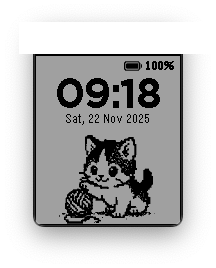
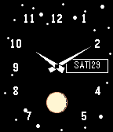

# Pebble Watch Faces

A collection of custom watch faces for Pebble smartwatches.

| [Meow O'Clock](meow-o-clock/) | [Perryverse Falcon](watchface/) | [Moonphase](moonphase/) | [Lemming Brothers](lemming/) |
|:-----------------------------:|:-------------------------------:|:------------------------:|:----------------------------:|
|  |  |  |  |

## Building

Each watchface is a Nix package, built from this flake:

```sh
nix build .#lemming      --option sandbox false   # -> result/lemming-brothers-v1.0.0.pbw
nix build .#meow-o-clock --option sandbox false   # -> result/meow-o-clock-v1.4.0.pbw
nix build .#moonphase    --option sandbox false   # -> result/moonphase-v1.0.0.pbw
```

Or all three at once, into `result`, `result-1` and `result-2`:

```sh
nix build .#lemming .#meow-o-clock .#moonphase --option sandbox false
```

Three things about that command are easy to get wrong:

- **`--option sandbox false` is required.** The builds `pip install pebble-tool` and
  download the Pebble SDK, so they need network access. On macOS you will see
  `ignoring the client-specified setting 'sandbox' ... you are not a trusted user`;
  that is harmless, because macOS does not sandbox by default. On Linux and in CI the
  setting does matter, and you have to be a trusted user for it to apply.
- **The attribute is the directory name, not the app name.** `nix build .#lemming`
  produces `lemming-brothers-v1.0.0.pbw`; there is no `.#lemming-brothers` attribute.
- **`watchface/` (Perryverse Falcon) is not packaged** and has no attribute. Only the
  three above build.
