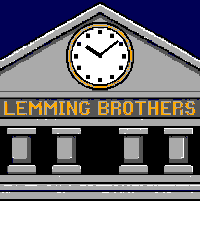

# Lemming Brothers

A Pebble watchface: the facade of a neoclassical bank with a working clock in its
pediment. Flick your wrist and three lemming bank clerks walk across the plaza with their
briefcases. The rest of the time it is just the bank and the time.



Built for **basalt** (144x168), **diorite** and **flint** (144x168, 1-bit) and **emery**
(200x228). Every pixel in every colour asset is a legal Pebble RGB222 colour — each
channel one of `00`, `55`, `AA`, `FF`; the 1-bit assets are derived from them.

## Layout

```
        sky                     flat #000055
   ┌──────────────────┐
   │             80%  │  battery percentage, right-aligned in the sky wedge
   │   ╱▔▔▔▔▔▔▔╲      │  pediment, with a blank dial in the middle.
   │  ╱   (◷)   ╲     │  The ring, ticks and centre dot are part of the
   │ ╱           ╲    │  background bitmap; the app draws only the hands.
   ├──────────────────┤
   │ LEMMING BROTHERS │  frieze
   ├──────────────────┤
   │  ▮   ▮   ▮   ▮   │  portico
   ├──────────────────┤
   │══════════════════│  steps
   │   🐹🐹🐹  →       │  plaza — the walk-cycle sprite is translated across here
   └──────────────────┘
```

## Asset pipeline

Two generated assets, each with its own prompt file under `resources/prompts/`.

### Background — `lemming-bank`

`generate_image.sh` → `scene_to_pebble.sh`. An image model draws the facade at ~960x1104;
the converter crops in, splices a slab out of the column shafts, scales to width, and
remaps to a curated RGB222 palette.

Three things in that converter are not obvious, and all three are load-bearing:

- **Curated palette, not all 64 RGB222 entries.** Nearest-neighbour over the full palette
  sends near-neutral stone (`#D8D4CC`) to `#FFAAAA` — the whole building comes out pink.
- **The sky is recoloured explicitly.** The generated navy `#243456` sits almost exactly
  between `#000055` and `#555555`, and nearest-neighbour picks the grey — in Lab as well
  as in RGB. It is the only colour that needs the override.
- **Scale to width, never cover-crop.** 144x168 is a taller aspect than 200x228, so
  cropping to it clips the ends off "LEMMING BROTHERS". The leftover height is padded with
  sky above and plaza below.

> **Re-rolling the background is not free.** `--crop-w 813 --cut 560,177` are measurements
> of *this* generation. A new roll puts the pediment, frieze and plaza at different rows,
> so those two flags must be re-measured, and the dial constants in `src/c/config.h`
> re-derived from the new bitmap, or the hands will not sit on the dial.

### Walk cycle — `lemming-walk`

`generate_image.sh` → `generate_video.sh` → `walk_to_pebble.sh`. The still of the three
clerks is generated first and pinned as veo-3.1-lite's `first_frame`; given only text the
video model drifts off palette and off model within a second. It is prompted for a
locked-off camera over flat `#00FF00`, and the characters **walk on the spot** — the
horizontal travel is the app's job, so the resource stays a 6-frame 97x34 strip rather
than a 50-frame full-screen sequence.

Also not obvious:

- **Alpha and colour are carried separately.** `-remap` discards the alpha channel, so
  keying first and remapping second silently returns an opaque frame with the background
  green snapped to whichever art colour is nearest.
- **Colour is mapped in two steps.** A single remap to RGB222 puts the navy suit on grey
  (colliding with the head cap), the gold briefcase on beige (colliding with the ears),
  and the red tie on brown. Fuzzy `-opaque` overrides do not fix it — the suit and the cap
  are 9% apart in RGB, so any fuzz wide enough to catch the video's compression noise also
  eats the cap. Instead the frame is snapped to the video's own flat colours at full
  resolution, then each of those is substituted at fuzz 0.
- **The APNG is written by `apng.py`, not ImageMagick.** IM's APNG coder always emits
  colour-type 6 (RGBA) and ignores `-type`/`-define png:color-type`; Pebble's on-watch PNG
  decoder reads palettized and grayscale only, so an IM-written APNG loads as nothing.
  `apng.py` writes colour-type 3 + `tRNS`, matching the working sequences in
  `meow-o-clock/resources`. It is also 10x smaller (3.9 KB vs 37 KB).

### Black and white — `lemming-bw`

`to_bw.sh` derives the diorite/flint assets from the **composed** 144x168 colour ones,
never from a fresh generation: `src/c/config.h`'s dial and sprite constants were measured
off those exact files, so anything that changes framing or scale silently invalidates
them. Every operation is a per-pixel colour substitution, so the geometry is untouched by
construction.

The mapping is spelled out colour by colour rather than thresholded on luminance:

- **`#AAAAAA` stone and `#555555` frieze/shafts sit either side of mid-grey.** A threshold
  splits them the right way by luck, not by intent, and any re-render moves them.
- **`#FFAA00` gold is the frieze lettering *and* the clock rim**, which want opposite
  values. Both go white: the lettering reverses out of the black frieze, and the rim melts
  into the white dial but the art already carries a black outline ring just outside it,
  which is what then reads as the bezel.
- **The lemmings cross a white plaza**, so they are mapped to near-silhouettes — only the
  shirt front, face patch and paws stay white, held off the plaza by the black outline
  that already surrounds them.

> **The walk cycle ships as six `bitmap` resources on 1-bit platforms, not as the APNG.**
> The sequence decoder *does* read the APNG on diorite and flint — it fills the target
> bitmap and returns cleanly — but drawing that bitmap then faults inside the firmware.
> That was observed with a plain 1-bit blank target under both `GCompOpSet` and
> `GCompOpAssign`; a palettized blank target was not tried, so the sequence path is not
> proven impossible, only not worth the hunt. Plain `bitmap` resources sidestep the
> on-watch decoder entirely: the SDK
> converts each PNG to the platform's native 1-bit form at *build* time. The frames are
> written as grayscale+alpha at depth 1, which is the format the resource compiler turns
> into a transparent 1-bit pbi — that is what makes `GCompOpSet` honour the cut-out
> instead of drawing an opaque block over the steps.

### Preview — `lemming-preview`

`preview_watchface.sh` composites background + procedural hands + the traversing sprite
into an animated GIF, using the same constants the app compiles in. If the preview looks
right, `src/c/config.h` is right.

## App

Split per the [modular app architecture][mod] guide:

```
src/c/
  main.c                     orchestrator
  config.h                   per-display layout constants
  modules/battery_text.{h,c} battery percentage in the top-right sky
  modules/clock_hands.{h,c}  analog hands on the blank dial
  modules/walk_anim.{h,c}    the walk cycle + its traverse across the plaza
  modules/glance.{h,c}       wrist-flick detection
  windows/bank_window.{h,c}  wires the four together
```

Following the [battery guide][bat]: `MINUTE_UNIT` ticks rather than `SECOND_UNIT`; the
accelerometer runs at 10Hz in batches of 10, waking the app once a second; the animation
runs only on a wrist flick, and its timer is cancelled outright when the traverse ends, so
an idle watchface costs nothing beyond one hand redraw a minute. The battery layer is
event-driven for the same reason — it redraws on the charge-change event, not on a timer,
and the firmware only reports charge in 10% steps, so it fires perhaps ten times a day.

Wrist-flick detection is ported from `meow-o-clock`: rather than a tap impulse, it watches
for the accelerometer entering the zone corresponding to the watch being turned towards
the wearer, and fires once per entry. Flicks during a traverse are ignored — restarting
mid-cross would teleport the group back off-screen.

Footprint: 2644 bytes RAM and 10320 bytes of resources on emery, 2597 and 6736 on
diorite/flint.

## Building

For a release bundle, build the Nix package from the repo root — it installs the SDK,
regenerates the 1-bit assets and builds all four platforms in one step:

```sh
nix build .#lemming --option sandbox false   # -> result/lemming-brothers-v1.0.0.pbw
```

The attribute is `lemming`, after the directory, not `lemming-brothers`. It needs
`--option sandbox false` because the build pip-installs `pebble-tool` and downloads the
SDK. See the root [README](../README.md#building).

For iterating, build in the devenv shell instead. `pebble` is wrapped by a shell
function in the devenv `enterShell` (devenv exports
`CC=clang`, which hijacks waf's ARM cross-compiler detection). From a non-interactive
shell you need the same thing by hand:

```sh
env -u CC -u CXX pebble build
env -u CC -u CXX pebble install --emulator emery
```

The emulator produces no realistic accelerometer data. Either set
`LEMMING_DEBUG_AUTOSTART` to 1 in `windows/bank_window.c`, or inject the transition:

```sh
{ for i in $(seq 1 40); do echo "0, 900, -300"; done      # arm down, outside the zone
  for i in $(seq 1 40); do echo "0, -500, -800"; done     # wrist turned up, inside it
} > flick.txt
env -u CC -u CXX pebble emu-accel custom flick.txt
```

## Not covered

- **aplite.** 1-bit like diorite and flint, so the assets and the animation path already
  exist, but its 24K app RAM and 128K resource ceiling are the tightest of the family and
  nothing here has been measured against them.
- **chalk.** 180x180 and round; the facade would need recomposing for a circular frame.
- No date or bluetooth indicators — the battery percentage is the only readout.

[mod]: https://developer.repebble.com/guides/best-practices/modular-app-architecture/
[bat]: https://developer.repebble.com/guides/best-practices/conserving-battery-life/
