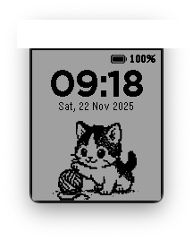
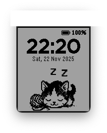

# Meow O'Clock

Animated kitten that plays by day and sleeps by night.

## Features

- **Animated Kitten**: Switches between playtime animation and sleeping animation
- **Time Display**: Large, clear time in 24-hour format
- **Date Display**: Shows day, date, month, and year (e.g., "Sat, 22 Nov 2025")
- **Battery Indicator**: Icon and percentage display in top right corner
- **Multi-platform Support**: Compatible with Pebble aplite, basalt, diorite and flint

## Screenshots

| Daytime | Nighttime |
|:---------------------:|:-----------------------:|
|  |  |

## Installation

1. Build the watchface:

   ```bash
   pebble build
   ```

2. Install to emulator:

   ```bash
   pebble install --emulator basalt
   ```

3. Install to watch:

   ```bash
   pebble install --phone <IP_ADDRESS>
   ```

## Credits

- Cat animations: Designed with Gemini AI
- [Charging icons created by redempticon - Flaticon](https://www.flaticon.com/free-icons/charging)
- [Battery icons created by Stockio - Flaticon](https://www.flaticon.com/free-icons/battery)
